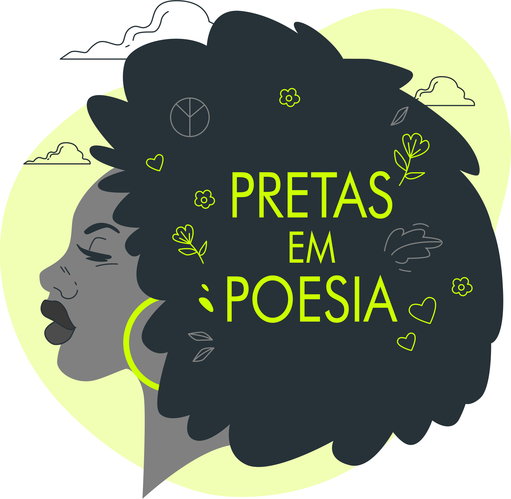

# **Pretas em Poesia**

## *Banco de Dados para mulheres pretas que soltam o grito da sua resistência na poesia.*

## Sumário: 
[APRESENTAÇÃO](#APRESENTAÇÃO)
[Rotas](#Rotas-da-Api)

## *APRESENTAÇÃO:*

O Projeto tem o interesse em reunir mulheres negras enquanto um mecanismo de resistência em sua fala e seus escritos, buscando referenciar e resgastar a produção autoral de poetisas negras (brasileiras) como Conceição Evaristo, Carolina Maria de Jesus, Cristiane Sobral, Cidinha da Silva, Elisa Lucinda, dentre outras e, principalmente, incentivar e valorizar a produção autoral das mulheres negras.

Sendo assim, contribuir para um contexto do qual, cada vez mais, mulheres negras estão buscando e lutando por mais representatividade nos espaços institucionalizados, políticos, sociais e acadêmicos.

## **Rotas da API:**

*Utilizaremos os seguintes métodos na construção da API:*

| Verbo      | Descrição                                  | Rotas 
| ---------- | ----------                                 | ----------                                                               |
| GET        | Listar todas as inscritas no BD.           |                                                                           | 
| GET ByID   | Listar as inscritas por id.                |                                                                          | 
| POST       | Adicionar/Cadastrar nova participante.     |                                                                          |
| PUT        | Substituir todas as informações pelo id.   |                                                                          | 
| DELETE     | Remover uma ou mais participante.          |                                                                          |

<!-- #### GET: Listar todas as inscritas no BD;
#### GET ID: Listar as inscritas por id;
#### POST: Adicionar/Cadastrar nova participante;
#### PUT: Substituir todas as informações pelo id;
#### DELETE: Remover uma ou mais participante; -->

[Fonte Referencia](https://www.ufmg.br/prae/acoes-afirmativas/projetos-apoiados-em-2017/preta-e-poeta/)

<!-- 
## **Mulheres pretas e suas resistências poéticas:**

A escrita e a declamação representam ferramentas de expressão importantes para aquelas que, sistematicamente, não tiveram acesso ao direito de fala e que, por meio da escrita, conseguem externar, codificar e, possivelmente, compartilhar a própria produção, se convencendo da potencialidade da própria escrita. Além de nos entendermos enquanto, autor e autoridade do que escreve, contando a própria história e não mais como mero sujeito sob o olhar analítico do outro. A intenção é integrar o processo de produção autoral com o de declamação mediante o Sarau, afim de dar voz àquilo que sempre esteve escrito mas que ainda não sabemos qual entonação a voz projetará ou qual expressão o corpo fará a partir do momento que, se possibiliza um espaço de compartilhamento para se expressar e historicamente marginalizado, que vem, cada vez mais, buscando e ressignificando os espaços políticos, institucionais e sociais a partir do momento da sua inserção e expressão das suas demandas específicas.

 -->
